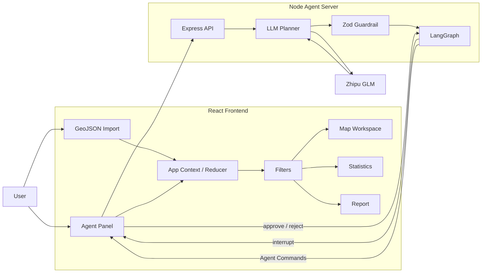
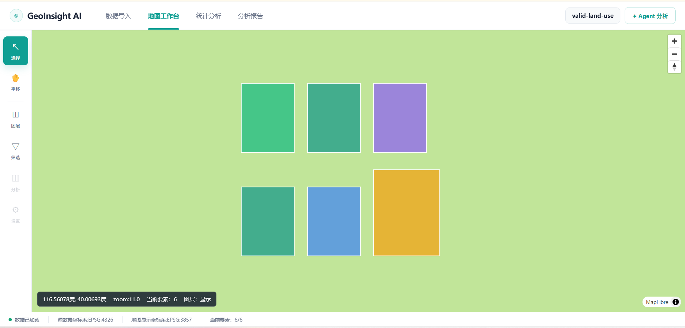
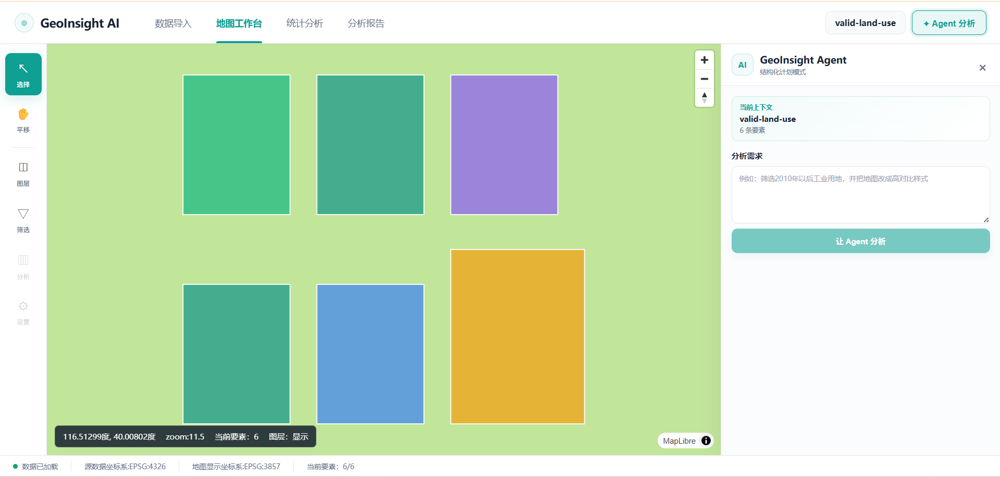
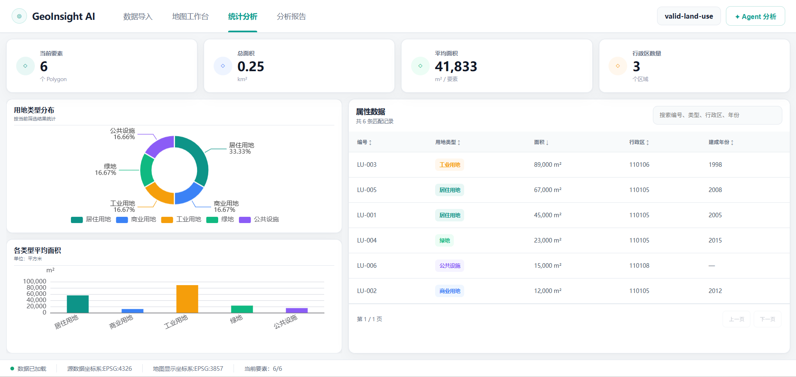

# GeoInsight AI

> AI-powered spatial data visualization and analysis platform built with React, TypeScript, MapLibre and LangGraph.

## Live Demo

[Open GeoInsight AI](https://geoinsightai.onrender.com)

> The demo is deployed on a free Render instance.
> The first request after a period of inactivity may require a short cold start.

GeoInsight AI 是一个面向城市空间数据分析场景的 Web GIS 应用。

项目支持 GeoJSON 空间数据导入、运行时校验、地图可视化、属性筛选、图层样式编辑、统计分析与报告生成，并集成基于智谱 GLM + LangGraph 的受约束 GIS Agent，使用户可以通过自然语言生成结构化 GIS 操作计划，在人工确认后安全执行筛选和地图样式修改。

---

## Features

### Spatial data import

- GeoJSON / JSON 文件导入
- 基于运行时 Schema 的数据校验
- 属性字段预览
- 数据质量检查
- 空间预览
- EPSG:4326 数据输入

### GIS workspace

- MapLibre GL 地图渲染
- Polygon 分类着色
- 地图缩放与平移
- 图层显示控制
- 用地类型筛选
- 最小建成年份筛选
- 行政区筛选
- 实时 `GeoJSONSource.setData()` 更新

### Layer style editor

- 分类色 / 单色模式
- 填充颜色与透明度
- 边框颜色、宽度与透明度
- 图层显隐控制
- 样式预设
- Reset / Save

## GIS Measurement

支持：

- Distance measurement
- Polygon area measurement
- Turf.js spatial calculation
- Dynamic GeoJSON rendering
- Multi-unit area display

技术：

- MapLibre GL
- Turf.js
- React state management

### Statistics dashboard

- 当前要素数量
- 总面积
- 平均面积
- 行政区数量
- 用地类型环形图
- 各类型平均面积柱状图
- 属性搜索
- 排序
- 分页

### GeoInsight Agent

- 智谱 GLM 大模型
- Function Calling
- Structured Agent Plan
- Zod Runtime Validation
- Command Allowlist
- LangGraph StateGraph
- Human-in-the-loop approval
- `interrupt()` / `resume`
- Checkpoint + thread id
- Agent Command → React State
- 一步 Undo

### Analysis report

- 根据当前筛选状态自动生成报告
- 核心指标汇总
- 用地类型统计
- 属性明细
- 浏览器 Print / PDF 导出

---

## Tech Stack

### Frontend

- React 19
- TypeScript
- Vite
- React Router
- MapLibre GL
- ECharts

### AI / Backend

- Node.js
- Express
- Zod
- LangGraph.js
- 智谱 GLM
- OpenAI-compatible API

---

## Architecture



---

## Agent Workflow

GeoInsight AI 不允许大模型直接操作 DOM 或 MapLibre。

LLM 只能生成预定义的结构化 Command：

```text
User Prompt
    ↓
GLM Function Calling
    ↓
AgentPlan
    ↓
Zod Validation
    ↓
LangGraph
    ↓
Human Approval
    ↓
AgentCommand
    ↓
React State
    ↓
MapLibre / Statistics
```

例如：

```json
{
  "type": "apply_filter",
  "payload": {
    "landUseTypes": ["industrial"],
    "minimumBuiltYear": 2010
  }
}
```

前端确认后通过已有状态系统执行，而不是让 LLM 直接操作地图。

---

## Human-in-the-loop

涉及修改应用状态的操作需要用户确认：

```text
create_plan
     ↓
review
     ↓
interrupt()
     ↓
approve / reject
   ↙            ↘
execute        cancel
     ↓
    END
```

开发版本使用 LangGraph `MemorySaver` 保存线程级 checkpoint。

---

## Project Structure

```text
GeoInsightAI/
├── src/
│   ├── agent/
│   ├── app/
│   ├── components/
│   │   ├── agent/
│   │   ├── layers/
│   │   ├── map/
│   │   └── statistics/
│   ├── pages/
│   ├── styles/
│   ├── types/
│   └── utils/
│
├── server/
│   ├── agent/
│   │   ├── graph.ts
│   │   ├── planner.ts
│   │   ├── prompt.ts
│   │   ├── schemas.ts
│   │   └── tools.ts
│   ├── llm/
│   └── index.ts
│
└── public/
```

---

## Local Development

### 1. Install dependencies

```bash
npm install
```

### 2. Configure environment variables

Copy:

```bash
.env.example
```

to:

```bash
.env
```

Configure:

```env
ZAI_API_KEY=your_api_key
ZAI_BASE_URL=https://open.bigmodel.cn/api/paas/v4/
ZAI_MODEL=glm-4.7-flash
PORT=8787
```

Do not commit `.env`.

### 3. Start Agent server

```bash
npm run server
```

Default:

```text
http://localhost:8787
```

### 4. Start frontend

```bash
npm run dev
```

Default:

```text
http://localhost:5173
```

Vite forwards `/api` requests to the Express Agent server during local development.

---

## Build

```bash
npm run build
```

---

## Example Agent Prompts

```text
筛选2010年以后工业用地
```

```text
把填充透明度改成40%
```

```text
清除所有筛选条件
```

```text
打开统计分析页面
```

Mutating operations require confirmation before execution.

---

## Design Principles

### Single Source of Truth

筛选状态统一由 React Context / Reducer 管理，地图、统计页面和报告页面都消费同一份派生数据。

### Declarative React + Imperative GIS

React 管理应用状态，通过 `useEffect` 将状态同步到 MapLibre：

```text
React State
    ↓
useEffect
    ↓
MapLibre API
```

而不是重新创建 Map。

### Never Trust Model Output

LLM 输出必须经过：

```text
Function Calling
    ↓
JSON
    ↓
Zod Validation
    ↓
Command Allowlist
```

通过校验后才可能进入执行阶段。

### Prompt constraints are not security boundaries

危险操作是否需要确认，不仅依靠 Prompt，还由确定性 TypeScript 逻辑强制判断。

---

## Roadmap

Possible future extensions:

- Shapefile / CSV spatial import
- PostGIS backend
- Persistent LangGraph checkpoint
- RAG over urban planning documents
- MCP-based GIS data services
- Multi-layer spatial analysis

These features are intentionally outside the current MVP.

---

## Author

Built as a full-stack GIS + AI engineering project using React, TypeScript, MapLibre and LangGraph.


## Screenshots

### GIS Workspace



### Human-in-the-loop Agent



### Statistics Dashboard

